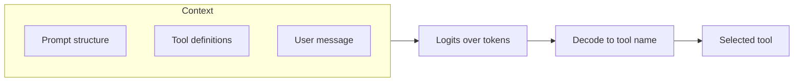

# Lab 1: The Anatomy of a Decision — Prompt Structure and Tool Selection Accuracy

**Series**: Agentic Engineering Crash Course  
**Module**: 1 — Tokenization & Logit Control (Understanding Stochasticity)  
**Prerequisites**: Python 3.10+, OpenAI API key  

---

## Before You Start

If you are new to LLMs and agents, these minimal concepts will help you follow the lab:

- **Prompt**: The text (and structure) you send to the model. It usually includes a system message (instructions, tool list) and a user message (the current request). The model’s reply is *conditioned* on this entire prompt.
- **LLM (Large Language Model)**: A model that takes text as input and produces text (or structured output) as output. It has no memory between calls; each response depends only on what you send in that request.
- **API call**: You use a service (e.g. OpenAI) by sending an HTTP request with your prompt and API key. The service runs the model and returns the completion. This lab uses the OpenAI Python client to make these calls.
- **Token**: The basic unit of text the model processes (roughly words or subwords). Models have a fixed **context window** (max tokens per request); your prompt and response must fit within it.

You do **not** need prior knowledge of neural networks, attention, or softmax to complete this lab.

---

## How to use this tutorial in Google Colab

1. Open [Google Colab](https://colab.research.google.com/) and create a new notebook.
2. For each **markdown section** below: insert a **Text cell** and paste the section.
3. For each **code block**: insert a **Code cell** and paste the code, then run.
4. Run cells in order from top to bottom.

**Suggested time**: 45–60 min.  
**Experiments**: Baseline (required). Exploration: Experiments 1–3 required; Experiment 4 optional.

For definitions of key terms (e.g. logits, token, context window, tool call), see [Glossary](Glossary.md).

---

## 1. Learning Objectives

By the end of this lab you will be able to:

1. **Relate** prompt layout and wording to which tool (or no-tool) the model selects.
2. **Observe** that tool choice is a discrete decision over a finite set (logits over tool names/IDs).
3. **Use** this to debug and improve EOP agent behavior when the wrong tool is chosen.
4. **Design** a system prompt with role, audience, and EOP advocacy guidance (concept explanation and objection handling).

---

## 2. Theoretical Why: Why Prompt Structure Affects Tool Selection

*See **前置概念** above for minimal definitions of prompt, LLM, API, and token.*

### Mechanism

Tool selection is a **conditional decoding step**: the model produces logits over the next tokens; when the interface is "tool call," those tokens map to tool names or a tool-call schema. The prompt is the conditioning context; its structure (order of system vs. user message, placement of tool definitions, few-shot examples, and delimiter clarity) changes the effective context and thus the distribution over next tokens.

$$P(\text{tool} \mid \text{prompt})$$

Concepts to keep in mind:

- **Context window and attention**: Only a fixed number of tokens are "visible"; where you put tool definitions and examples changes what the model attends to.
- **Format alignment**: If the model was fine-tuned or instructed with a specific format (e.g. "Here are the tools: … Now respond with a tool call"), deviating from that format increases the chance of "format drift" and wrong or no tool selection.
- **Stochasticity**: Same prompt can yield different tool choices across runs (temperature > 0); prompt design reduces variance and shifts the mode toward the intended tool.

**Maintenance connection (brief)**: When an EOP agent picks the wrong tool, the first place to look is **prompt structure** (order of system content, tool list placement, and examples), then sampling parameters.

### Flow (context → tool choice)



---

## 2.5 System Prompt Design: Role, Audience, and EOP Advocacy

Before we use the system prompt only for **tool selection**, it helps to see what a **system message** is made of. In EOP agents, the same system prompt often does two jobs: (1) set the **role** and **audience** so the agent can *advocate* for EOP when the user asks conceptual questions; (2) list **tools** and **output format** so the agent can route to tools when the user asks for actions.

### Anatomy of a system prompt

| Element | Purpose | Example |
|--------|---------|---------|
| **Role** | Who the model "is" | "You are an EOP (Evidence-Oriented Programming) assistant helping researchers understand and adopt EOP/ECF." |
| **Audience** | Who the model is talking to | "Your audience may be authors, reviewers, or editors; adapt depth to their experience." |
| **Task / instructions** | What to do in general | "Explain EOP concepts when asked; when the user wants to annotate or link artifacts, use the provided tools." |
| **Tools** (if any) | What actions are available | (We add this in the baseline below.) |
| **Output format** | How to respond (e.g. TOOL: name) | "For tool use, reply with exactly one line: TOOL: &lt;name&gt;." |

### EOP advocacy: example phrasing and objection handling

When the user asks *"What is EOP?"* or *"How is this different from reproducibility?"*, the agent should answer in **natural language** (no tool call). You steer that by putting brief guidance in the system prompt:

- **Concept**: "EOP focuses on *evidentiary sufficiency*: whether the disclosed software and data give enough information to evaluate the support for scientific claims. Reproducibility is about whether results can be reproduced; EOP is about whether claims are adequately supported by what is disclosed."
- **Objection**: "If the user says 'This is too much overhead', acknowledge the concern and mention that EOP can be adopted incrementally (e.g. start with one pipeline and an entry document) and that structured disclosure can reduce ad-hoc reviewer requests."

In a full EOP agent you might add tools like `get_eop_concept` or `get_example_case`; for this lab we focus on **how the system prompt text shapes both conversational answers and tool choice**.

### Minimal advocacy system prompt (no tools yet)

The following snippet builds a **pure advocacy** system prompt (no tool list). We send one user question and show that the model's reply is conditioned on this system message. Later we add tools to the same prompt.

```python
# Cell: Advocacy system prompt (role + audience + EOP guidance)

def build_advocacy_system_prompt() -> str:
    """System message for EOP advocacy: role, audience, and objection handling."""
    return """You are an EOP (Evidence-Oriented Programming) assistant. You help researchers understand and adopt EOP/ECF for research software disclosure.

Your audience may be authors, reviewers, or editors; adapt explanation depth to their experience.

EOP focuses on evidentiary sufficiency: whether the disclosed software and data give enough information to evaluate the support for scientific claims. Reproducibility is about whether results can be reproduced; EOP is about whether claims are adequately supported by what is disclosed.

If the user says adoption is "too much overhead", acknowledge the concern and mention that EOP can be adopted incrementally (e.g. start with one pipeline and an entry document) and that structured disclosure can reduce ad-hoc reviewer requests.

Answer conceptual questions in 2–4 short sentences. Be precise and practical."""


# Run once (requires client, MODEL from Setup below — run Setup cells first, then this cell)
# Or run this after Setup to see advocacy-only behaviour.
def ask_advocacy(user_message: str, system: str = None) -> str:
    """One turn: system (advocacy) + user message -> assistant reply (no tools)."""
    if system is None:
        system = build_advocacy_system_prompt()
    response = client.chat.completions.create(
        model=MODEL,
        temperature=0.3,
        messages=[
            {"role": "system", "content": system},
            {"role": "user", "content": user_message},
        ],
        max_tokens=256,
    )
    return (response.choices[0].message.content or "").strip()


# Example: run after Setup
# reply = ask_advocacy("What is EOP? How is it different from reproducibility?")
# print(reply)
# reply2 = ask_advocacy("This seems like too much overhead for our lab.")
# print(reply2)
```

**Note**: Run the **Setup** cells (Section 3) first so `client` and `MODEL` are defined; then run the cell above. **Observe**: The reply tone and content follow the role and guidance in the system prompt. Changing the system text (e.g. add "Be concise" or "Always mention the evidence chain") changes the distribution over replies — same idea as tool selection being conditioned on the prompt.

---

## 3. Setup

**Dependencies**: Python 3.10+, `openai`. No LangChain/LangGraph needed for this lab.

**Using NVIDIA NIM**: To use the NVIDIA NIM API instead of OpenAI, set the environment variable `USE_NIM=1` (or set `NIM_API_KEY`) before running the setup cell. Optionally set `NIM_MODEL` to another NIM model ID (default: `nvidia/llama-3.3-nemotron-super-49b-v1.5`). The same pattern applies to all Labs 1–6.

### 3.1 Install and import

```python
# Cell: Install dependencies
!pip install -q openai
```

```python
# Cell: Imports and API key (OpenAI or NVIDIA NIM)
import os
import re
from collections import Counter
from getpass import getpass

from openai import OpenAI

use_nim = os.environ.get("USE_NIM", "").lower() in ("1", "true", "yes") or "NIM_API_KEY" in os.environ
if use_nim:
    if "NIM_API_KEY" not in os.environ:
        os.environ["NIM_API_KEY"] = getpass("Enter your NVIDIA API key (NIM): ")
    client = OpenAI(
        base_url="https://integrate.api.nvidia.com/v1",
        api_key=os.environ["NIM_API_KEY"],
    )
    MODEL = os.environ.get("NIM_MODEL", "nvidia/llama-3.3-nemotron-super-49b-v1.5")
else:
    if "OPENAI_API_KEY" not in os.environ:
        os.environ["OPENAI_API_KEY"] = getpass("Enter your OpenAI API key: ")
    client = OpenAI()
    MODEL = "gpt-4o-mini"  # Affordable, sufficient for this lab
print(f"Using model: {MODEL}")
```

---

## 4. Baseline Code: Minimal Working Example

One minimal script that (1) defines a tiny set of tools (`get_weather`, `search_docs`), (2) builds a **structured prompt** (system message with tool definitions + user message), (3) calls an LLM, (4) parses the response to see which tool was selected (or none).

**Prompt template**: "You have two tools: A) get_weather, B) search_docs. Reply with exactly one line: TOOL: &lt;name&gt;."

```python
# Cell: Tool definitions and prompt template

TOOLS = {
    "get_weather": "Retrieve the current weather for a given city. Use when the user asks about weather, temperature, or forecast.",
    "search_docs": "Search internal documentation by keyword. Use when the user asks about policies, procedures, or technical references.",
}


def build_system_prompt(tools: dict) -> str:
    """Build a system message listing the available tools."""
    tool_block = "\n".join(
        f"  {i+1}. {name} — {desc}" for i, (name, desc) in enumerate(tools.items())
    )
    return (
        "You are a tool-routing assistant. You have the following tools:\n"
        f"{tool_block}\n\n"
        "Given the user's message, decide which single tool to invoke.\n"
        "Reply with exactly one line in the format:\n"
        "TOOL: <tool_name>\n"
        "Do not include any other text."
    )


def parse_tool_choice(response_text: str):
    """Extract the tool name from a 'TOOL: <name>' response."""
    match = re.search(r"TOOL:\s*(\S+)", response_text, re.IGNORECASE)
    return match.group(1) if match else None


# Preview the system prompt
system_prompt = build_system_prompt(TOOLS)
print(system_prompt)
```

```python
# Cell: Single tool-selection call

def select_tool(user_message: str, tools: dict, temperature: float = 0.0, model: str = MODEL):
    """Send a prompt to the model and return the raw response, parsed tool choice, and prompt used."""
    system = build_system_prompt(tools)
    response = client.chat.completions.create(
        model=model,
        temperature=temperature,
        messages=[
            {"role": "system", "content": system},
            {"role": "user", "content": user_message},
        ],
        max_tokens=30,
    )
    text = response.choices[0].message.content.strip()
    return {
        "user_message": user_message,
        "raw_response": text,
        "parsed_tool": parse_tool_choice(text),
        "temperature": temperature,
    }


# Baseline run
result = select_tool("What's the weather in New York?", TOOLS)
print("User message :", result["user_message"])
print("Raw response :", result["raw_response"])
print("Parsed tool  :", result["parsed_tool"])
```

**Expected output**: `TOOL: get_weather`. The prompt is clear, the user query unambiguously matches one tool, and temperature is 0 (deterministic).  
**Record**: Note the parsed tool. This is our **control** result.

---

## 5. Exploration Lab: Purposely Failing or Stochastic Behavior

Each experiment isolates one variable. Run each, record the results, and compare to the baseline.

### Helper: Batch runner

Run the same query N times and tally tool selections.

```python
# Cell: Batch helper

def run_batch(user_message: str, tools: dict, n: int = 10, temperature: float = 0.0, label: str = ""):
    """Run select_tool n times and return a frequency table of parsed tool choices."""
    results = [select_tool(user_message, tools, temperature=temperature) for _ in range(n)]
    choices = [r["parsed_tool"] for r in results]
    freq = Counter(choices)
    print(f"\n--- {label or user_message} (n={n}, temp={temperature}) ---")
    for tool, count in freq.most_common():
        pct = count / n * 100
        print(f"  {tool or 'PARSE_FAIL'}: {count}/{n} ({pct:.0f}%)")
    print(f"  Sample raw: {results[0]['raw_response']}")
    return {"label": label, "freq": dict(freq), "sample_raw": results[0]["raw_response"]}
```

---

### Experiment 1: Order sensitivity

**Variable**: Order of tool definitions (e.g. put `search_docs` first vs. `get_weather` first).  
**Control**: Same user query, run multiple times; record which tool is chosen.

**Hypothesis**: Definition order can bias selection (recency or primacy).

```python
# Cell: Experiment 1 — Order sensitivity

tools_order_A = {"get_weather": TOOLS["get_weather"], "search_docs": TOOLS["search_docs"]}
tools_order_B = {"search_docs": TOOLS["search_docs"], "get_weather": TOOLS["get_weather"]}
query = "What's the weather in New York?"

run_batch(query, tools_order_A, n=5, temperature=0.0, label="Order A (weather first)")
run_batch(query, tools_order_B, n=5, temperature=0.0, label="Order B (docs first)")
```

**Observe**: With temperature=0 and an unambiguous query, order may have no effect (both often return `get_weather` 100%). Order effects show up more with ambiguous queries or higher temperature.  
**Record**: Were the results identical across orders? Document yes/no.

---

### Experiment 2: Vague vs. clear user prompt

**Variable**: User message clarity.  
**Control**: Same two tools, same temperature (e.g. 0.7 to reveal variance).

**Hypothesis**: Vague prompts lead to more inconsistent or wrong tool choices.

```python
# Cell: Experiment 2 — Vague vs. clear prompt

CLEAR_QUERY = "What's the weather in New York?"
VAGUE_QUERY = "Help me"
AMBIGUOUS_QUERY = "I need information"  # Could be weather OR docs

run_batch(CLEAR_QUERY, TOOLS, n=10, temperature=0.7, label="Clear query")
run_batch(VAGUE_QUERY, TOOLS, n=10, temperature=0.7, label="Vague query")
run_batch(AMBIGUOUS_QUERY, TOOLS, n=10, temperature=0.7, label="Ambiguous query")
```

**Observe**: Clear query → mostly one tool; vague/ambiguous → mixed distribution or parse failures.  
**Record**: Tally each distribution. Prompt clarity is a **variance reducer**.

---

### Experiment 3: Temperature

**Variable**: `temperature=0` vs `temperature=0.7` (or sweep 0, 0.3, 0.7, 1.2).  
**Control**: Same tools, same user message.

**Hypothesis**: Higher temperature increases variance in tool selection.

```python
# Cell: Experiment 3 — Temperature sweep

PROBE_QUERY = "I need some information about conditions outside."  # Deliberately ambiguous

for t in [0.0, 0.3, 0.7, 1.2]:
    run_batch(PROBE_QUERY, TOOLS, n=10, temperature=t, label=f"temp={t}")
```

**Observe**: At temp=0, identical runs; as temperature increases, minority tool appears more; at high temp, parse failures may appear.  
**Record**: For each temperature, note the majority tool and percentage. Compare variance.

---

### Experiment 4: Format drift

**Variable**: Remove the explicit format instruction ("Reply with exactly one line: TOOL: &lt;name&gt;").  
**Control**: Same tools, same user message, temperature=0.

**Hypothesis**: Breaking the prompt format causes the model to output free text instead of a parseable tool choice — illustrating the **interface contract** between prompt and parsing.

```python
# Cell: Experiment 4 — Format drift

def build_system_prompt_no_format(tools: dict) -> str:
    """System prompt WITHOUT the explicit format instruction."""
    tool_block = "\n".join(
        f"  {i+1}. {name} — {desc}" for i, (name, desc) in enumerate(tools.items())
    )
    return (
        "You are a helpful assistant. You have access to the following tools:\n"
        f"{tool_block}\n\n"
        "Please help the user with their request."
    )


def select_tool_no_format(user_message: str, tools: dict, temperature: float = 0.0, model: str = MODEL):
    """Like select_tool but uses the broken prompt."""
    system = build_system_prompt_no_format(tools)
    response = client.chat.completions.create(
        model=model,
        temperature=temperature,
        messages=[
            {"role": "system", "content": system},
            {"role": "user", "content": user_message},
        ],
        max_tokens=100,
    )
    text = response.choices[0].message.content.strip()
    return {
        "user_message": user_message,
        "raw_response": text,
        "parsed_tool": parse_tool_choice(text),
        "temperature": temperature,
    }


query = "What's the weather in New York?"
print("=== WITH format instruction ===")
for _ in range(3):
    r = select_tool(query, TOOLS, temperature=0.0)
    print(f"  Parsed: {r['parsed_tool']!r:20s} Raw: {r['raw_response']}")

print("\n=== WITHOUT format instruction ===")
for _ in range(3):
    r = select_tool_no_format(query, TOOLS, temperature=0.0)
    print(f"  Parsed: {r['parsed_tool']!r:20s} Raw: {r['raw_response'][:120]}")
```

**Observe**: With format instruction → parser succeeds. Without it → model often responds in natural language; parser returns `None` (format drift).  
**Implication**: Every tool-routing prompt needs an explicit, tested format contract.

---

## 6. Maintenance Connection: How This Helps Debug or Scale the EOP Agent

### Debugging

When the EOP agent selects the wrong tool:

1. Inspect **prompt structure** (system message, tool list order, few-shot examples).
2. Check **user message clarity** and whether the intended tool is unambiguous.
3. Consider **temperature** and **determinism** for critical tool-routing steps.
4. Verify that the **output format** in the prompt matches what the parser expects (avoid format drift).

### Scaling

As you add more tools, prompt length grows; **order and grouping** of tools and **hierarchical descriptions** (categories) can keep tool selection accurate. Log (prompt hash, user message, selected tool) for A/B tests on prompt variants.

### Link to Module 1

The next step is **tokenization and logit control** (e.g. constrained decoding or logit bias toward tool names) to further stabilize tool selection. Lab 2 will cover **Tool Definition & Pydantic** so that tool names and arguments are unambiguous and parseable.

---

## 7. Summary and Next Steps

### Three takeaways

1. **Prompt structure conditions the distribution over tool choices.** Order, clarity, and format consistency change which tool the model selects.
2. **Order, clarity, and format consistency reduce errors and variance.** Clear user query + explicit format contract make tool selection more deterministic.
3. **Systematic experiments (order, temperature, format) are the right way to diagnose tool-selection failures in production.** Isolate variables and measure; do not guess.

### What's next

**Lab 2 / Module 2 — Tool Definition & Pydantic**: Defining the interface so that tool names and arguments are unambiguous and parseable.

---

*End of Lab 1. Proceed to Lab 2 when ready.*
