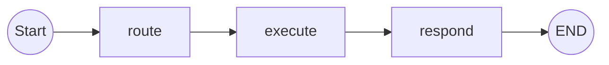

# Lab 4: Graphs, Cycles & Recovery — LangGraph and Flow Logic

**Series**: Agentic Engineering Crash Course  
**Module**: 4 — LangGraph / Flow Logic (Handling Cycles and Error Recovery)  
**Prerequisites**: Labs 1–3 (prompt structure, Pydantic tools, multi-turn state), Python 3.10+, OpenAI API key  

---

## How to use this tutorial in Google Colab

1. Open [Google Colab](https://colab.research.google.com/) and create a new notebook.
2. For each **markdown section** below: insert a **Text cell** and paste the section.
3. For each **code block**: insert a **Code cell** and paste the code, then run.
4. Run cells in order from top to bottom.

**Suggested time**: 60–75 min.  
**Experiments**: Baseline (required). Exploration: Experiments 1–3 required; Experiments 4–5 optional.

---

## 1. Learning Objectives

By the end of this lab you will be able to:

1. **Model** an agent workflow as a directed graph with nodes (actions) and edges (transitions).
2. **Build** a LangGraph workflow with conditional routing, cycles (retry loops), and terminal states.
3. **Observe** how graph structure affects reliability: what happens when a node fails, when a cycle doesn't terminate, when fallback logic is missing.
4. **Implement** error-recovery patterns: retry with backoff, fallback tools, and human-in-the-loop escalation.

---

## 2. Theoretical Why: Agents as Graphs

### Mechanism

An agentic workflow is a **state machine** or **directed graph**. Each **node** performs an action (LLM call, tool execution, validation). Each **edge** encodes a transition condition. The graph passes a **state object** through nodes; each node reads and writes to it.

Concepts to keep in mind:

- **DAG vs. cyclic graph**: Simple pipelines (e.g. retrieve → generate → respond) are **DAGs**. Agents that self-correct or retry require **cycles** (e.g. route → execute → on failure → route again).
- **State as edge payload**: The state object (messages, tool results, retry count, etc.) flows along the edges; routing decisions are based on it.
- **Conditional edges**: The next node depends on the output of the current node (e.g. "if tool call failed, retry; if succeeded, proceed; if max retries exceeded, escalate").
- **Termination guarantees**: Cycles need **explicit exit conditions** (max iterations, success criteria) to avoid infinite loops.

**Maintenance connection**: EOP agent failures often show up as **hung workflows** (infinite retry) or **silent failures** (no fallback path). Understanding the graph structure is essential for diagnosing these. When something goes wrong, trace the path through the graph and check exit conditions and fallbacks.

---

## 3. Setup

**Dependencies**: Python 3.10+, `openai`, `langgraph`, `langchain-core`, `langchain-openai`.

```python
# Cell: Install dependencies
!pip install -q openai langgraph langchain-core langchain-openai
```

```python
# Cell: Imports and API key (OpenAI or NVIDIA NIM)
import os
import random
from getpass import getpass

from langchain_openai import ChatOpenAI
from langgraph.graph import StateGraph, END
from langgraph.prebuilt import ToolNode

use_nim = os.environ.get("USE_NIM", "").lower() in ("1", "true", "yes") or "NIM_API_KEY" in os.environ
if use_nim:
    if "NIM_API_KEY" not in os.environ:
        os.environ["NIM_API_KEY"] = getpass("Enter your NVIDIA API key (NIM): ")
    MODEL = os.environ.get("NIM_MODEL", "nvidia/llama-3.3-nemotron-super-49b-v1.5")
    llm = ChatOpenAI(
        base_url="https://integrate.api.nvidia.com/v1",
        api_key=os.environ["NIM_API_KEY"],
        model=MODEL,
        temperature=0.0,
    )
else:
    if "OPENAI_API_KEY" not in os.environ:
        os.environ["OPENAI_API_KEY"] = getpass("Enter your OpenAI API key: ")
    MODEL = "gpt-4o-mini"
    llm = ChatOpenAI(model=MODEL, temperature=0.0)
print(f"Using model: {MODEL}")
```

---

## 4. Baseline Code: Three-Node Graph (Route → Execute → Respond)

### 為什麼用圖來做 Agent（Why Use a Graph for the Agent?）

Before writing code, it helps to see *why* we model the agent as a graph:

- **Maintainability**: The flow is explicit. You can read the graph (nodes + edges) and see exactly where routing, execution, and response happen. No hidden state machines buried in conditionals.
- **Debugging**: When something goes wrong, you trace the path: which node ran, which edge was taken, what the state was. Failures map to specific nodes or edges (e.g. "execute failed" or "retry loop never exited").
- **Retry and fallback**: Cycles (e.g. route → execute → on failure → back to route) and alternate paths (e.g. fallback node when retries are exhausted) are natural in a graph. You add edges and conditions instead of ad-hoc loops.
- **Visualization**: Tools like LangGraph can draw the graph so the whole workflow is visible at a glance.

A minimal agent flow looks like this:



We define a minimal graph:

1. **route** — LLM decides which tool to call (or to respond).
2. **execute** — Simulate tool execution (may succeed or fail).
3. **respond** — Format the result for the user.

Edges: `route → execute → respond → END`. State holds messages and the last tool result.

### 4.1 State and tools

```python
# Cell: State and tool definitions

from typing import Annotated, TypedDict
from langgraph.graph.message import add_messages

class AgentState(TypedDict):
    messages: Annotated[list, add_messages]
    last_tool_result: str
    retry_count: int

def tool_get_weather(query: str) -> str:
    """Get the current weather. Use when the user asks about weather."""
    return "Sunny, 72°F"

def tool_search_docs(query: str) -> str:
    """Search documentation. Use when the user asks about docs or policies."""
    return "Found 3 relevant articles."

# Bind tools to the LLM
tools = [tool_get_weather, tool_search_docs]
llm_with_tools = llm.bind_tools(tools)
```

### 4.2 Nodes and graph (no cycle yet)

```python
# Cell: Baseline graph — route → execute → respond

def route_node(state: AgentState) -> AgentState:
    """LLM decides: call a tool or answer directly."""
    response = llm_with_tools.invoke(state["messages"])
    return {"messages": [response], "last_tool_result": state.get("last_tool_result", ""), "retry_count": state.get("retry_count", 0)}

def execute_node(state: AgentState) -> AgentState:
    """Execute the last tool call from the assistant message. Always succeeds in baseline."""
    last_msg = state["messages"][-1]
    if not getattr(last_msg, "tool_calls", None):
        return {**state, "last_tool_result": "No tool call."}
    tool_node = ToolNode(tools)
    result = tool_node.invoke(state)
    # Get the last tool message content as string
    new_msgs = result["messages"]
    last_tool_msg = new_msgs[-1] if new_msgs else None
    tool_result_str = last_tool_msg.content if last_tool_msg and hasattr(last_tool_msg, "content") else str(new_msgs)
    return {"messages": new_msgs, "last_tool_result": tool_result_str, "retry_count": state.get("retry_count", 0)}

def respond_node(state: AgentState) -> AgentState:
    """Format final response for the user."""
    response = llm.invoke(state["messages"])
    return {"messages": [response], "last_tool_result": state.get("last_tool_result", ""), "retry_count": state.get("retry_count", 0)}

# Build graph
graph_baseline = StateGraph(AgentState)
graph_baseline.add_node("route", route_node)
graph_baseline.add_node("execute", execute_node)
graph_baseline.add_node("respond", respond_node)
graph_baseline.set_entry_point("route")
graph_baseline.add_edge("route", "execute")
graph_baseline.add_edge("execute", "respond")
graph_baseline.add_edge("respond", END)

app_baseline = graph_baseline.compile()

# Run
initial = {"messages": [("user", "What's the weather today?")], "last_tool_result": "", "retry_count": 0}
result = app_baseline.invoke(initial)
print("Final message:", result["messages"][-1].content if result["messages"] else "—")
```

**Expected**: The graph runs route → execute → respond; the agent calls the weather tool and returns a short answer.  
**Record**: Final message content and that the path is linear.

---

## 5. Exploration Lab: Failures, Retries, Fallback, and Human-in-the-Loop

**Experiment 1** is required to see failure without retry. **Experiments 2–5** are optional (選做) for retry cycles, fallback, conditional routing, and human-in-the-loop.

### Experiment 1: Tool execution failure (no retry) — **Required**

**Variable**: Make `execute` fail randomly (e.g. 50% of the time).  
**Hypothesis**: Without retry logic, about half of runs produce errors or incomplete responses.

```python
# Cell: Experiment 1 — Execute fails 50%

def execute_node_flaky(state: AgentState) -> AgentState:
    """Execute tool, but fail 50% of the time."""
    if random.random() < 0.5:
        return {
            **state,
            "last_tool_result": "ERROR: Tool execution failed (simulated).",
            "messages": state["messages"]
            + [type(state["messages"][0])(content="ERROR: Tool execution failed.", role="tool")],
        }
    return execute_node(state)

graph_flaky = StateGraph(AgentState)
graph_flaky.add_node("route", route_node)
graph_flaky.add_node("execute", execute_node_flaky)
graph_flaky.add_node("respond", respond_node)
graph_flaky.set_entry_point("route")
graph_flaky.add_edge("route", "execute")
graph_flaky.add_edge("execute", "respond")
graph_flaky.add_edge("respond", END)
app_flaky = graph_flaky.compile()

for run in range(4):
    r = app_flaky.invoke({"messages": [("user", "What's the weather?")], "last_tool_result": "", "retry_count": 0})
    last = r["messages"][-1].content if r["messages"] else ""
    print(f"Run {run+1}: {last[:80]}...")
```

**Observe**: Some runs succeed, some reflect the error. **Record**: Proportion of runs that showed an error. **Implication**: Production graphs need retry or fallback when tools fail.

---

### Experiment 2: Retry cycle with max_retries — **Optional (選做)**

**Variable**: Add a cycle: `route → execute → (if fail and retries < 3 → route else → respond)`.  
**Hypothesis**: Transient failures are recovered; once max retries are used, we proceed to respond (or fallback).

```python
# Cell: Experiment 2 — Retry cycle (max 3)

MAX_RETRIES = 3

def route_node_retry(state: AgentState) -> AgentState:
    retry_count = state.get("retry_count", 0)
    response = llm_with_tools.invoke(state["messages"])
    return {"messages": [response], "last_tool_result": state.get("last_tool_result", ""), "retry_count": retry_count}

def execute_node_with_fail(state: AgentState) -> AgentState:
    if random.random() < 0.6:  # Fail 60%
        return {
            **state,
            "last_tool_result": "ERROR",
            "retry_count": state.get("retry_count", 0) + 1,
        }
    return execute_node(state)

def should_retry(state: AgentState) -> str:
    if state.get("last_tool_result") == "ERROR" and state.get("retry_count", 0) < MAX_RETRIES:
        return "route"
    return "respond"

graph_retry = StateGraph(AgentState)
graph_retry.add_node("route", route_node_retry)
graph_retry.add_node("execute", execute_node_with_fail)
graph_retry.add_node("respond", respond_node)
graph_retry.set_entry_point("route")
graph_retry.add_edge("route", "execute")
graph_retry.add_conditional_edges("execute", should_retry, {"route": "route", "respond": "respond"})
graph_retry.add_edge("respond", END)
app_retry = graph_retry.compile()

# Run a few times and observe retry count
for run in range(3):
    r = app_retry.invoke({"messages": [("user", "Weather?")], "last_tool_result": "", "retry_count": 0})
    print(f"Run {run+1}: retry_count={r.get('retry_count', 0)}")
```

**Observe**: When execute fails, the graph loops back to route; when it succeeds or retries are exhausted, it goes to respond. **Record**: Distribution of retry counts over several runs.

---

### Experiment 3: Fallback path when retries exhausted — **Optional (選做)**

**Variable**: Add a **fallback** node that returns a canned message when retries are exhausted.  
**Hypothesis**: The agent degrades gracefully instead of returning an error to the user.

```python
# Cell: Experiment 3 — Fallback node

def fallback_node(state: AgentState) -> AgentState:
    """Canned response when we give up after retries."""
    from langchain_core.messages import HumanMessage, AIMessage
    return {
        "messages": [AIMessage(content="I couldn't complete that request after several tries. Please try again later or contact support.")],
        "last_tool_result": state.get("last_tool_result", ""),
        "retry_count": state.get("retry_count", 0),
    }

def route_or_fallback(state: AgentState) -> str:
    if state.get("last_tool_result") == "ERROR" and state.get("retry_count", 0) < MAX_RETRIES:
        return "route"
    if state.get("last_tool_result") == "ERROR":
        return "fallback"
    return "respond"

graph_fallback = StateGraph(AgentState)
graph_fallback.add_node("route", route_node_retry)
graph_fallback.add_node("execute", execute_node_with_fail)
graph_fallback.add_node("respond", respond_node)
graph_fallback.add_node("fallback", fallback_node)
graph_fallback.set_entry_point("route")
graph_fallback.add_edge("route", "execute")
graph_fallback.add_conditional_edges("execute", route_or_fallback, {"route": "route", "respond": "respond", "fallback": "fallback"})
graph_fallback.add_edge("respond", END)
graph_fallback.add_edge("fallback", END)
app_fallback = graph_fallback.compile()

r = app_fallback.invoke({"messages": [("user", "Weather?")], "last_tool_result": "", "retry_count": 0})
print("Final:", r["messages"][-1].content[:120])
```

**Observe**: When all retries fail, the user sees the fallback message instead of a raw error. **Record**: That the graph always terminates (either respond or fallback).

---

### Experiment 4: Conditional routing (two tools) — **Optional (選做)**

**Variable**: Two tools; route conditionally based on LLM output (which tool was chosen).  
**Hypothesis**: The state object carries the routing decision; we can log or branch on it.

```python
# Cell: Experiment 4 — Conditional routing (concept)

# The LLM already chooses the tool via tool_calls; execute_node runs whichever tool was called.
# "Conditional routing" here means: the graph branches only via should_retry / route_or_fallback.
# For a second tool, we just ensure both tools are bound — the same graph works.
# Run once with a docs query to see the other tool.
r_docs = app_baseline.invoke({"messages": [("user", "Search the docs for API usage.")], "last_tool_result": "", "retry_count": 0})
print("Docs query ->", r_docs["messages"][-1].content[:100] if r_docs["messages"] else "")
```

**Observe**: Same graph handles different tools; the LLM's tool_calls determine what execute runs. **Record**: For "docs" query, the agent should call search_docs.

---

### Experiment 5: Human-in-the-loop (simulated) — **Optional (選做)**

**Variable**: Add an **escalate** node that "pauses" for simulated human input, then continues.  
**Hypothesis**: Demonstrates an escape hatch when the agent cannot resolve the request.

```python
# Cell: Experiment 5 — Escalate (simulated human)

def escalate_node(state: AgentState) -> AgentState:
    """Simulate human-in-the-loop: we inject a fixed 'human decision' and continue."""
    from langchain_core.messages import HumanMessage, AIMessage
    # In production, this would wait for real user input
    human_reply = "Human: Use this response: 'The weather service is temporarily unavailable. Try again in 10 minutes.'"
    return {
        "messages": state["messages"] + [HumanMessage(content=human_reply)],
        "last_tool_result": "escalated",
        "retry_count": state.get("retry_count", 0),
    }

def after_execute(state: AgentState) -> str:
    if state.get("last_tool_result") == "ERROR" and state.get("retry_count", 0) >= MAX_RETRIES:
        return "escalate"
    if state.get("last_tool_result") == "ERROR":
        return "route"
    return "respond"

graph_escalate = StateGraph(AgentState)
graph_escalate.add_node("route", route_node_retry)
graph_escalate.add_node("execute", execute_node_with_fail)
graph_escalate.add_node("respond", respond_node)
graph_escalate.add_node("escalate", escalate_node)
graph_escalate.set_entry_point("route")
graph_escalate.add_edge("route", "execute")
graph_escalate.add_conditional_edges("execute", after_execute, {"route": "route", "respond": "respond", "escalate": "escalate"})
graph_escalate.add_edge("escalate", "respond")  # After human input, format and end
graph_escalate.add_edge("respond", END)
app_escalate = graph_escalate.compile()

r = app_escalate.invoke({"messages": [("user", "Weather?")], "last_tool_result": "", "retry_count": 0})
print("With escalation path:", r["messages"][-1].content[:150] if r["messages"] else "")
```

**Observe**: When retries are exhausted, the graph goes to escalate; the simulated human reply is then passed to respond. **Record**: That the final answer can reflect the "human" message.

---

## 6. Maintenance Connection: Reading and Evolving EOP Agent Graphs

### Reading a LangGraph definition

- **Nodes**: Identify each node (route, execute, respond, fallback, escalate). Each is a function that takes state and returns state updates.
- **Edges**: Conditional edges implement branching; fixed edges implement linear flow. Check that every cycle has a bounded exit (max_retries, success).

### Common failure patterns

| Pattern | Symptom | Fix |
|--------|---------|-----|
| Infinite retry | Workflow never ends | Add max_retries and route to fallback or escalate |
| Silent failure | No error, no answer | Add fallback node and ensure errors set last_tool_result (or similar) |
| State corruption | Wrong data passed between nodes | Validate state shape; use TypedDict and clear keys |

### Adding a new tool or node

- Add a new tool to the list bound to the LLM; add a new node if the action is not “call a tool” (e.g. a validation node). Connect it with an edge from the appropriate predecessor and to the appropriate successor. Ensure state keys are consistent.

---

## 7. Summary and Next Steps

### Four takeaways

1. **Agents are graphs.** Nodes are actions; edges are transitions; state flows through the graph.
2. **Cycles need bounds.** Use max_retries or success conditions so the graph always terminates.
3. **Fallbacks prevent silent failures.** When retries are exhausted or a node fails, route to a fallback or human-in-the-loop node.
4. **State flows through edges.** Keep state shape consistent (e.g. AgentState) so every node can read and write the same keys.

### Capstone idea

Combine Labs 1–4: a multi-tool agent with structured schemas (Lab 2), persistent memory (Lab 3), and graph-based orchestration with retry and fallback (Lab 4).

### Checkpoint: Self-check before Lab 5 (Foundation 1–4)

Before moving to the domain labs (Lab 5–6), confirm you can:

| Skill | Labs | Self-check question |
|-------|------|----------------------|
| Prompt → tool selection | 1 | Can you debug wrong tool choice using prompt structure or temperature? |
| Tool schema & validation | 2 | Can you add a tool with Pydantic and handle invalid args? |
| Multi-turn state & history | 3 | Can you maintain messages and optional state across turns? |
| Graph: nodes, edges, state | 4 | Can you read a LangGraph and say what each node does and when retry/fallback run? |

If yes, you’re ready to plug domain logic (ECF extraction, disclosure advice) in as tools or nodes in Lab 5–6.

### What's next

**Lab 5 — Evidence Chain Extraction**: Domain layer. Given a messy research repo, identify ECF's seven artifacts and suggest restructuring.

---

*End of Lab 4. Proceed to Lab 5 when ready.*
